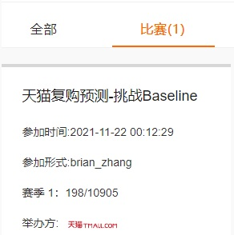

# Alibaba Tianchi Competition - Tmall Repurchase Prediction
**Building comprehensive user and merchant features through feature engineering and utilizing machine learning model (xgboost) to predict whether users will repurchase.**
Competition Results:
* Date 2021/11/27: Ranking: 91, Score: 0.6876512.
* (Updated) Date 2023/10/09: Ranking: 198 / 10904 (Top 2%) \

## File Description
* feature_engineering.ipynb: Feature engineering on the training and testing datasets, generating processed datasets.
* trainer_evaluator.ipynb: Creating and training the model, then predicting the testing dataset using the model, and saving the prediction results locally.
* tb_repurchase_.ipyhb: Used for data analysis, plotting, and visualization.
To replicate this algorithm, simply run the first two Jupyter notebooks.

## Info
Author: Weihong Zhang, College of AI, UCAS. \
This is the programming assignment implementation for the Data Mining course, Autumn semester, 2021-2022 in UCAS.